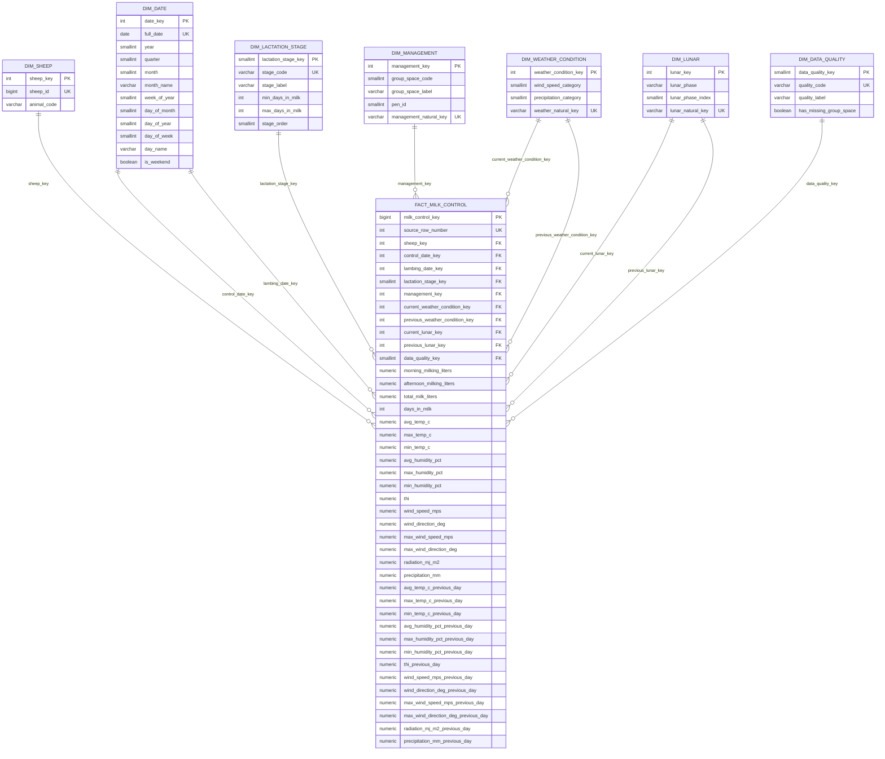

# Diagrama del modelo dimensional

## Grano

Una fila de `fact_milk_control` representa una observación individual registrada en una fila de la hoja `Hoja1`.

## Dimensiones reutilizadas por rol

* `DIM_DATE` se utiliza como fecha de control y fecha de parto.
* `DIM_WEATHER_CONDITION` se utiliza para el día del control y el día anterior.
* `DIM_LUNAR` se utiliza para el día del control y el día anterior.

## Nota sobre cardinalidad

Las dimensiones contienen descripciones relativamente estáticas o catálogos de contexto. Las medidas repetibles y los eventos se concentran en `FACT_MILK_CONTROL`.
